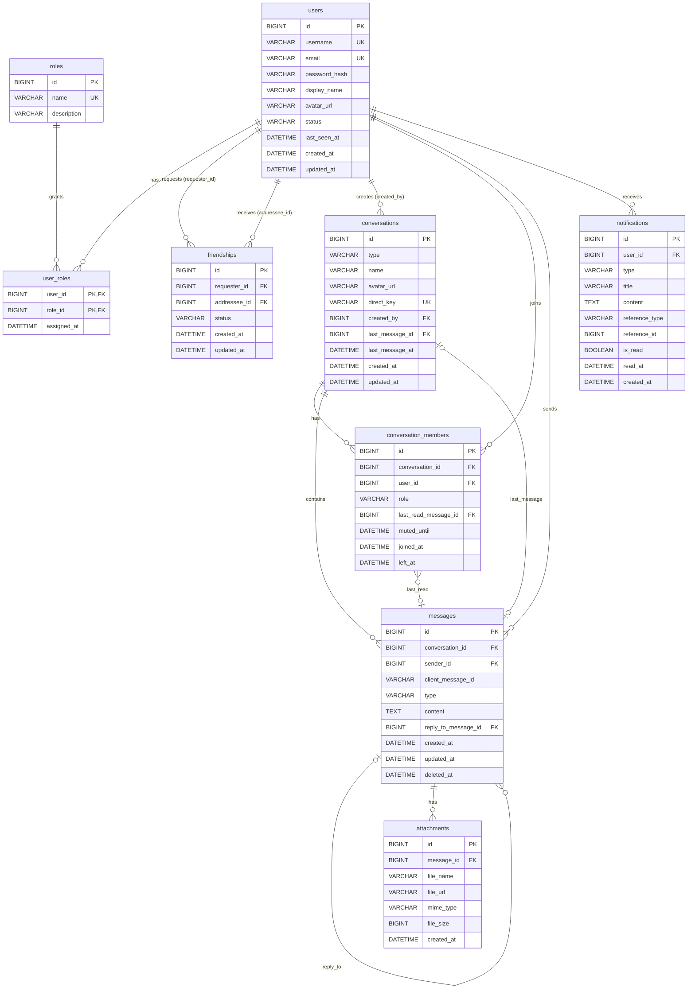

# Chat Application — Database ERD (v1.0)

> **Database:** MySQL 8.0 · InnoDB · `utf8mb4` / `utf8mb4_0900_ai_ci`
> **Backend:** Spring Boot (Spring Data JPA + Flyway) · **Cache/Realtime:** Redis · **Realtime:** WebSocket (STOMP)
> **Nguồn:** hợp nhất từ sơ đồ dbdiagram hiện tại (roles, user_has_role, conversation_participants, chat_messages, conversations) và tài liệu mô tả ERD (friendships, attachments, notifications, soft delete, reply).

---

## 1. Mục tiêu

- Quản lý người dùng & phân quyền hệ thống (RBAC)
- Quản lý quan hệ bạn bè
- Quản lý cuộc trò chuyện 1-1 (DIRECT) và nhóm (GROUP)
- Quản lý thành viên, vai trò trong nhóm, trạng thái đã đọc
- Quản lý tin nhắn (reply, soft delete, chống gửi trùng)
- Quản lý file đính kèm
- Quản lý thông báo
- MySQL là **source of truth**; Redis chỉ giữ dữ liệu tạm / có thể dựng lại

---

## 2. Thay đổi so với sơ đồ hiện tại (dbdiagram)

| # | Sơ đồ cũ | ERD chuẩn | Lý do |
|---|----------|-----------|-------|
| 1 | `id varchar` ở mọi bảng | `id BIGINT UNSIGNED AUTO_INCREMENT` | Index nhỏ hơn, insert tuần tự (không phân mảnh B-Tree như UUID ngẫu nhiên), phân trang theo `id` dễ dàng. Nếu cần ID công khai → thêm cột `public_id` (UUIDv7/ULID) sau. |
| 2 | `user_has_role` có `id` riêng | `user_roles` khóa chính kép `(user_id, role_id)` | Bảng nối thuần, tránh trùng cặp user–role. |
| 3 | `users.password` | `users.password_hash` (BCrypt) | Không lưu plain text. |
| 4 | `conversation_participants` | `conversation_members` + `role`, `left_at`, `last_read_message_id`, `muted_until` | Hỗ trợ OWNER/ADMIN/MEMBER, rời nhóm, đã đọc theo từng người. |
| 5 | `chat_messages.media_files json` | Bảng `attachments` riêng | Chuẩn hóa, có FK, query/thống kê file được. |
| 6 | `conversations.last_message_content`, `last_message_time` | Giữ `last_message_id` (FK) + `last_message_at` | Tránh lưu trùng nội dung (bị sai khi sửa/xóa tin). `last_message_at` dùng để sắp xếp danh sách chat. |
| 7 | `conversations.participant_hash` | `direct_key` (UNIQUE, chỉ dùng cho DIRECT) | Đảm bảo 2 user chỉ có **một** cuộc chat 1-1. Giá trị: `"{minUserId}_{maxUserId}"`. |
| 8 | `messages.status` (SENT/DELIVERED/READ) trên tin nhắn | Bỏ; dùng `conversation_members.last_read_message_id` | Trong nhóm, mỗi người đọc ở thời điểm khác nhau → trạng thái không thể nằm trên 1 dòng message. |
| 9 | — | `messages.client_message_id` | Idempotency: client retry khi mất kết nối WebSocket không tạo tin trùng. |
| 10 | — | `friendships` + cột sinh `user_low_id/user_high_id` | Chặn trùng lời mời A→B và B→A. |

---

## 3. ERD (Mermaid)

> Xem trực tiếp trên GitHub/GitLab, VS Code (Markdown Preview Mermaid) hoặc dán vào draw.io: **Arrange → Insert → Advanced → Mermaid**.



### Sơ đồ quan hệ rút gọn

```text
 roles ──< user_roles >── users ──< friendships (requester / addressee)
                            │
           ┌────────────────┼──────────────────┬─────────────────┐
           ▼                ▼                  ▼                 ▼
   conversation_members  messages (sender)  notifications  conversations (created_by)
           │                ▲   │  ▲ reply_to (self)
           ▼                │   ▼
     conversations ─────────┘  attachments
       (1:N messages, last_message_id → messages)
```

---

## 4. Đặc tả bảng

Quy ước chung:
- Thời gian: `DATETIME(3)` lưu **UTC** (server MySQL & JVM đặt `UTC`).
- Enum lưu dạng `VARCHAR` + `CHECK` (dễ thêm giá trị, map `@Enumerated(EnumType.STRING)` trong JPA).
- `created_at` / `updated_at` do DB tự set (`DEFAULT CURRENT_TIMESTAMP(3)` / `ON UPDATE`).

### 4.1 `users` — tài khoản người dùng

| Column | Type | Constraint | Mô tả |
|---|---|---|---|
| id | BIGINT UNSIGNED | PK, AUTO_INCREMENT | User ID |
| username | VARCHAR(50) | UNIQUE, NOT NULL | Tên đăng nhập |
| email | VARCHAR(255) | UNIQUE, NOT NULL | Email |
| password_hash | VARCHAR(255) | NOT NULL | BCrypt hash |
| display_name | VARCHAR(100) | NOT NULL | Tên hiển thị |
| avatar_url | VARCHAR(500) | NULL | Ảnh đại diện |
| status | VARCHAR(20) | NOT NULL, DEFAULT 'ACTIVE' | `ACTIVE` · `INACTIVE` · `BANNED` |
| last_seen_at | DATETIME(3) | NULL | Lần online cuối (ghi từ Redis khi user offline) |
| created_at | DATETIME(3) | NOT NULL | |
| updated_at | DATETIME(3) | NOT NULL | |

> `status` là trạng thái **tài khoản**. Trạng thái **online/offline** nằm trong Redis (`online:{userId}`), không lưu ở MySQL.

### 4.2 `roles` — vai trò hệ thống

| Column | Type | Constraint | Mô tả |
|---|---|---|---|
| id | BIGINT UNSIGNED | PK | |
| name | VARCHAR(50) | UNIQUE, NOT NULL | `ROLE_USER`, `ROLE_ADMIN` |
| description | VARCHAR(255) | NULL | |

### 4.3 `user_roles` — bảng nối users ↔ roles (N:M)

| Column | Type | Constraint | Mô tả |
|---|---|---|---|
| user_id | BIGINT UNSIGNED | PK, FK → users.id (CASCADE) | |
| role_id | BIGINT UNSIGNED | PK, FK → roles.id (CASCADE) | |
| assigned_at | DATETIME(3) | NOT NULL | |

> Phân biệt: **role hệ thống** (`roles`) ≠ **role trong nhóm** (`conversation_members.role`).

### 4.4 `friendships` — quan hệ bạn bè

| Column | Type | Constraint | Mô tả |
|---|---|---|---|
| id | BIGINT UNSIGNED | PK | |
| requester_id | BIGINT UNSIGNED | FK → users.id, NOT NULL | Người gửi lời mời |
| addressee_id | BIGINT UNSIGNED | FK → users.id, NOT NULL | Người nhận |
| status | VARCHAR(20) | NOT NULL | `PENDING` · `ACCEPTED` · `REJECTED` · `BLOCKED` |
| user_low_id | BIGINT UNSIGNED | GENERATED = LEAST(requester_id, addressee_id) | Cột sinh |
| user_high_id | BIGINT UNSIGNED | GENERATED = GREATEST(requester_id, addressee_id) | Cột sinh |
| created_at / updated_at | DATETIME(3) | NOT NULL | |

Ràng buộc: `CHECK (requester_id <> addressee_id)`, `UNIQUE (user_low_id, user_high_id)`: mỗi cặp user chỉ có 1 dòng.

### 4.5 `conversations` — cuộc trò chuyện

| Column | Type | Constraint | Mô tả |
|---|---|---|---|
| id | BIGINT UNSIGNED | PK | |
| type | VARCHAR(20) | NOT NULL | `DIRECT` · `GROUP` |
| name | VARCHAR(100) | NULL | Chỉ dùng cho GROUP |
| avatar_url | VARCHAR(500) | NULL | Chỉ dùng cho GROUP |
| direct_key | VARCHAR(64) | UNIQUE, NULL | DIRECT: `"{minId}_{maxId}"`; GROUP: NULL |
| created_by | BIGINT UNSIGNED | FK → users.id (SET NULL), NULL | |
| last_message_id | BIGINT UNSIGNED | FK → messages.id (SET NULL), NULL | Tin mới nhất (denormalize có kiểm soát) |
| last_message_at | DATETIME(3) | NULL | Sắp xếp danh sách chat |
| created_at / updated_at | DATETIME(3) | NOT NULL | |

Ràng buộc: `CHECK ((type='DIRECT' AND direct_key IS NOT NULL) OR (type='GROUP' AND direct_key IS NULL))`.
MySQL cho phép nhiều giá trị NULL trong cột UNIQUE, nên GROUP không bị ảnh hưởng.

### 4.6 `conversation_members` — thành viên (N:M users ↔ conversations)

| Column | Type | Constraint | Mô tả |
|---|---|---|---|
| id | BIGINT UNSIGNED | PK | |
| conversation_id | BIGINT UNSIGNED | FK → conversations.id (CASCADE) | |
| user_id | BIGINT UNSIGNED | FK → users.id (CASCADE) | |
| role | VARCHAR(20) | NOT NULL, DEFAULT 'MEMBER' | `OWNER` · `ADMIN` · `MEMBER` |
| last_read_message_id | BIGINT UNSIGNED | FK → messages.id (SET NULL), NULL | Tin cuối cùng user đã đọc |
| muted_until | DATETIME(3) | NULL | Tắt thông báo đến thời điểm |
| joined_at | DATETIME(3) | NOT NULL | |
| left_at | DATETIME(3) | NULL | NULL = đang là thành viên |

Ràng buộc: `UNIQUE (conversation_id, user_id)`. Khi user quay lại nhóm, cập nhật lại dòng cũ (`left_at = NULL`, `joined_at = now`).

**Số tin chưa đọc:**
```sql
SELECT COUNT(*) FROM messages
WHERE conversation_id = :cid
  AND id > COALESCE(:lastReadMessageId, 0)
  AND sender_id <> :me AND deleted_at IS NULL;
```
**"Đã xem" trong chat 1-1:** đối phương có `last_read_message_id >= message.id`.

### 4.7 `messages` — tin nhắn

| Column | Type | Constraint | Mô tả |
|---|---|---|---|
| id | BIGINT UNSIGNED | PK | Tăng dần, dùng làm cursor phân trang |
| conversation_id | BIGINT UNSIGNED | FK → conversations.id (CASCADE), NOT NULL | |
| sender_id | BIGINT UNSIGNED | FK → users.id, NULL | NULL khi `type = SYSTEM` |
| client_message_id | VARCHAR(64) | NULL | UUID do client sinh, chống gửi trùng |
| type | VARCHAR(20) | NOT NULL, DEFAULT 'TEXT' | `TEXT` · `IMAGE` · `FILE` · `SYSTEM` |
| content | TEXT | NULL | NULL được nếu chỉ có file |
| reply_to_message_id | BIGINT UNSIGNED | FK → messages.id (SET NULL), NULL | Reply |
| created_at | DATETIME(3) | NOT NULL | Thời gian gửi |
| updated_at | DATETIME(3) | NOT NULL | Sửa tin (so với created_at để hiện "đã chỉnh sửa") |
| deleted_at | DATETIME(3) | NULL | Soft delete |

Ràng buộc: `UNIQUE (sender_id, client_message_id)`.

### 4.8 `attachments` — file đính kèm

| Column | Type | Constraint | Mô tả |
|---|---|---|---|
| id | BIGINT UNSIGNED | PK | |
| message_id | BIGINT UNSIGNED | FK → messages.id (CASCADE), NOT NULL | |
| file_name | VARCHAR(255) | NOT NULL | Tên gốc |
| file_url | VARCHAR(1000) | NOT NULL | URL / storage key (local volume, S3, MinIO) |
| mime_type | VARCHAR(100) | NULL | `image/png`, `application/pdf` … |
| file_size | BIGINT UNSIGNED | NULL | Bytes |
| created_at | DATETIME(3) | NOT NULL | |

> Chỉ lưu **metadata**; file nhị phân không lưu trong MySQL.

### 4.9 `notifications` — thông báo

| Column | Type | Constraint | Mô tả |
|---|---|---|---|
| id | BIGINT UNSIGNED | PK | |
| user_id | BIGINT UNSIGNED | FK → users.id (CASCADE) | Người nhận |
| type | VARCHAR(50) | NOT NULL | `FRIEND_REQUEST` · `FRIEND_ACCEPTED` · `NEW_MESSAGE` · `ADDED_TO_GROUP` |
| title | VARCHAR(255) | NOT NULL | |
| content | TEXT | NULL | |
| reference_type | VARCHAR(30) | NULL | `FRIENDSHIP` · `CONVERSATION` · `MESSAGE` |
| reference_id | BIGINT UNSIGNED | NULL | ID entity liên quan (không FK, vì đa hình) |
| is_read | BOOLEAN | NOT NULL, DEFAULT FALSE | |
| read_at | DATETIME(3) | NULL | |
| created_at | DATETIME(3) | NOT NULL | |

---

## 5. Relationships

| Quan hệ | Bản số | FK | ON DELETE |
|---|---|---|---|
| users ↔ roles | N:M (qua `user_roles`) | user_roles.user_id / role_id | CASCADE |
| users → friendships | 1:N (×2: requester, addressee) | requester_id, addressee_id | CASCADE |
| users → conversations (người tạo) | 1:N | conversations.created_by | SET NULL |
| users ↔ conversations | N:M (qua `conversation_members`) | conversation_id, user_id | CASCADE |
| conversations → messages | 1:N | messages.conversation_id | CASCADE |
| users → messages | 1:N | messages.sender_id | RESTRICT (user chỉ bị khóa, không xóa cứng) |
| messages → messages (reply) | 1:N (self) | reply_to_message_id | SET NULL |
| messages → attachments | 1:N | attachments.message_id | CASCADE |
| conversations → messages (last) | N:1, optional | last_message_id | SET NULL |
| conversation_members → messages (last read) | N:1, optional | last_read_message_id | SET NULL |
| users → notifications | 1:N | notifications.user_id | CASCADE |

---

## 6. Index Strategy

| Bảng | Index | Phục vụ |
|---|---|---|
| users | `UNIQUE(username)`, `UNIQUE(email)` | Đăng nhập, đăng ký |
| user_roles | PK `(user_id, role_id)`, `INDEX(role_id)` | Load quyền khi tạo JWT |
| friendships | `UNIQUE(user_low_id, user_high_id)` | Chống trùng |
| friendships | `INDEX(addressee_id, status)` | Danh sách lời mời đến |
| friendships | `INDEX(requester_id, status)` | Danh sách lời mời đã gửi / bạn bè |
| conversations | `UNIQUE(direct_key)` | Tìm/tạo chat 1-1 |
| conversations | `INDEX(last_message_at)` | Sắp xếp danh sách chat |
| conversation_members | `UNIQUE(conversation_id, user_id)` | Chống trùng thành viên, kiểm tra quyền |
| conversation_members | `INDEX(user_id, left_at)` | "Các cuộc chat của tôi" |
| messages | `INDEX(conversation_id, id)` | **Lịch sử chat, phân trang cursor** |
| messages | `INDEX(sender_id)` | |
| messages | `UNIQUE(sender_id, client_message_id)` | Idempotency |
| attachments | `INDEX(message_id)` | |
| notifications | `INDEX(user_id, is_read, created_at)` | Danh sách + badge chưa đọc |

> Phân trang theo **cursor** thay vì `OFFSET`:
> `SELECT … FROM messages WHERE conversation_id = ? AND id < :beforeId ORDER BY id DESC LIMIT 30;`

---

## 7. MySQL DDL (Flyway `V1__init_schema.sql`)

```sql
SET NAMES utf8mb4;

-- 1. users
CREATE TABLE users (
  id             BIGINT UNSIGNED NOT NULL AUTO_INCREMENT,
  username       VARCHAR(50)  NOT NULL,
  email          VARCHAR(255) NOT NULL,
  password_hash  VARCHAR(255) NOT NULL,
  display_name   VARCHAR(100) NOT NULL,
  avatar_url     VARCHAR(500) NULL,
  status         VARCHAR(20)  NOT NULL DEFAULT 'ACTIVE',
  last_seen_at   DATETIME(3)  NULL,
  created_at     DATETIME(3)  NOT NULL DEFAULT CURRENT_TIMESTAMP(3),
  updated_at     DATETIME(3)  NOT NULL DEFAULT CURRENT_TIMESTAMP(3) ON UPDATE CURRENT_TIMESTAMP(3),
  PRIMARY KEY (id),
  UNIQUE KEY uk_users_username (username),
  UNIQUE KEY uk_users_email (email),
  CONSTRAINT ck_users_status CHECK (status IN ('ACTIVE','INACTIVE','BANNED'))
) ENGINE=InnoDB DEFAULT CHARSET=utf8mb4 COLLATE=utf8mb4_0900_ai_ci;

-- 2. roles
CREATE TABLE roles (
  id           BIGINT UNSIGNED NOT NULL AUTO_INCREMENT,
  name         VARCHAR(50)  NOT NULL,
  description  VARCHAR(255) NULL,
  PRIMARY KEY (id),
  UNIQUE KEY uk_roles_name (name)
) ENGINE=InnoDB DEFAULT CHARSET=utf8mb4 COLLATE=utf8mb4_0900_ai_ci;

-- 3. user_roles
CREATE TABLE user_roles (
  user_id      BIGINT UNSIGNED NOT NULL,
  role_id      BIGINT UNSIGNED NOT NULL,
  assigned_at  DATETIME(3) NOT NULL DEFAULT CURRENT_TIMESTAMP(3),
  PRIMARY KEY (user_id, role_id),
  KEY idx_user_roles_role (role_id),
  CONSTRAINT fk_user_roles_user FOREIGN KEY (user_id) REFERENCES users(id) ON DELETE CASCADE,
  CONSTRAINT fk_user_roles_role FOREIGN KEY (role_id) REFERENCES roles(id) ON DELETE CASCADE
) ENGINE=InnoDB DEFAULT CHARSET=utf8mb4 COLLATE=utf8mb4_0900_ai_ci;

-- 4. friendships
CREATE TABLE friendships (
  id            BIGINT UNSIGNED NOT NULL AUTO_INCREMENT,
  requester_id  BIGINT UNSIGNED NOT NULL,
  addressee_id  BIGINT UNSIGNED NOT NULL,
  status        VARCHAR(20) NOT NULL DEFAULT 'PENDING',
  user_low_id   BIGINT UNSIGNED AS (LEAST(requester_id, addressee_id)) STORED,
  user_high_id  BIGINT UNSIGNED AS (GREATEST(requester_id, addressee_id)) STORED,
  created_at    DATETIME(3) NOT NULL DEFAULT CURRENT_TIMESTAMP(3),
  updated_at    DATETIME(3) NOT NULL DEFAULT CURRENT_TIMESTAMP(3) ON UPDATE CURRENT_TIMESTAMP(3),
  PRIMARY KEY (id),
  UNIQUE KEY uk_friendships_pair (user_low_id, user_high_id),
  KEY idx_friendships_addressee (addressee_id, status),
  KEY idx_friendships_requester (requester_id, status),
  CONSTRAINT fk_friendships_requester FOREIGN KEY (requester_id) REFERENCES users(id) ON DELETE CASCADE,
  CONSTRAINT fk_friendships_addressee FOREIGN KEY (addressee_id) REFERENCES users(id) ON DELETE CASCADE,
  CONSTRAINT ck_friendships_self   CHECK (requester_id <> addressee_id),
  CONSTRAINT ck_friendships_status CHECK (status IN ('PENDING','ACCEPTED','REJECTED','BLOCKED'))
) ENGINE=InnoDB DEFAULT CHARSET=utf8mb4 COLLATE=utf8mb4_0900_ai_ci;

-- 5. conversations (FK last_message_id thêm sau khi có bảng messages)
CREATE TABLE conversations (
  id               BIGINT UNSIGNED NOT NULL AUTO_INCREMENT,
  type             VARCHAR(20)  NOT NULL,
  name             VARCHAR(100) NULL,
  avatar_url       VARCHAR(500) NULL,
  direct_key       VARCHAR(64)  NULL,
  created_by       BIGINT UNSIGNED NULL,
  last_message_id  BIGINT UNSIGNED NULL,
  last_message_at  DATETIME(3)  NULL,
  created_at       DATETIME(3)  NOT NULL DEFAULT CURRENT_TIMESTAMP(3),
  updated_at       DATETIME(3)  NOT NULL DEFAULT CURRENT_TIMESTAMP(3) ON UPDATE CURRENT_TIMESTAMP(3),
  PRIMARY KEY (id),
  UNIQUE KEY uk_conversations_direct_key (direct_key),
  KEY idx_conversations_last_message_at (last_message_at),
  CONSTRAINT fk_conversations_created_by FOREIGN KEY (created_by) REFERENCES users(id) ON DELETE SET NULL,
  CONSTRAINT ck_conversations_type CHECK (type IN ('DIRECT','GROUP')),
  CONSTRAINT ck_conversations_direct_key CHECK (
    (type = 'DIRECT' AND direct_key IS NOT NULL) OR (type = 'GROUP' AND direct_key IS NULL))
) ENGINE=InnoDB DEFAULT CHARSET=utf8mb4 COLLATE=utf8mb4_0900_ai_ci;

-- 6. messages
CREATE TABLE messages (
  id                   BIGINT UNSIGNED NOT NULL AUTO_INCREMENT,
  conversation_id      BIGINT UNSIGNED NOT NULL,
  sender_id            BIGINT UNSIGNED NULL,
  client_message_id    VARCHAR(64) NULL,
  type                 VARCHAR(20) NOT NULL DEFAULT 'TEXT',
  content              TEXT NULL,
  reply_to_message_id  BIGINT UNSIGNED NULL,
  created_at           DATETIME(3) NOT NULL DEFAULT CURRENT_TIMESTAMP(3),
  updated_at           DATETIME(3) NOT NULL DEFAULT CURRENT_TIMESTAMP(3) ON UPDATE CURRENT_TIMESTAMP(3),
  deleted_at           DATETIME(3) NULL,
  PRIMARY KEY (id),
  KEY idx_messages_conversation_id (conversation_id, id),
  KEY idx_messages_sender (sender_id),
  KEY idx_messages_reply_to (reply_to_message_id),
  UNIQUE KEY uk_messages_client_id (sender_id, client_message_id),
  CONSTRAINT fk_messages_conversation FOREIGN KEY (conversation_id) REFERENCES conversations(id) ON DELETE CASCADE,
  CONSTRAINT fk_messages_sender       FOREIGN KEY (sender_id) REFERENCES users(id) ON DELETE RESTRICT,
  CONSTRAINT fk_messages_reply_to     FOREIGN KEY (reply_to_message_id) REFERENCES messages(id) ON DELETE SET NULL,
  CONSTRAINT ck_messages_type CHECK (type IN ('TEXT','IMAGE','FILE','SYSTEM'))
) ENGINE=InnoDB DEFAULT CHARSET=utf8mb4 COLLATE=utf8mb4_0900_ai_ci;

ALTER TABLE conversations
  ADD CONSTRAINT fk_conversations_last_message
  FOREIGN KEY (last_message_id) REFERENCES messages(id) ON DELETE SET NULL;

-- 7. conversation_members
CREATE TABLE conversation_members (
  id                    BIGINT UNSIGNED NOT NULL AUTO_INCREMENT,
  conversation_id       BIGINT UNSIGNED NOT NULL,
  user_id               BIGINT UNSIGNED NOT NULL,
  role                  VARCHAR(20) NOT NULL DEFAULT 'MEMBER',
  last_read_message_id  BIGINT UNSIGNED NULL,
  muted_until           DATETIME(3) NULL,
  joined_at             DATETIME(3) NOT NULL DEFAULT CURRENT_TIMESTAMP(3),
  left_at               DATETIME(3) NULL,
  PRIMARY KEY (id),
  UNIQUE KEY uk_members_conversation_user (conversation_id, user_id),
  KEY idx_members_user (user_id, left_at),
  CONSTRAINT fk_members_conversation FOREIGN KEY (conversation_id) REFERENCES conversations(id) ON DELETE CASCADE,
  CONSTRAINT fk_members_user         FOREIGN KEY (user_id) REFERENCES users(id) ON DELETE CASCADE,
  CONSTRAINT fk_members_last_read    FOREIGN KEY (last_read_message_id) REFERENCES messages(id) ON DELETE SET NULL,
  CONSTRAINT ck_members_role CHECK (role IN ('OWNER','ADMIN','MEMBER'))
) ENGINE=InnoDB DEFAULT CHARSET=utf8mb4 COLLATE=utf8mb4_0900_ai_ci;

-- 8. attachments
CREATE TABLE attachments (
  id          BIGINT UNSIGNED NOT NULL AUTO_INCREMENT,
  message_id  BIGINT UNSIGNED NOT NULL,
  file_name   VARCHAR(255)  NOT NULL,
  file_url    VARCHAR(1000) NOT NULL,
  mime_type   VARCHAR(100)  NULL,
  file_size   BIGINT UNSIGNED NULL,
  created_at  DATETIME(3) NOT NULL DEFAULT CURRENT_TIMESTAMP(3),
  PRIMARY KEY (id),
  KEY idx_attachments_message (message_id),
  CONSTRAINT fk_attachments_message FOREIGN KEY (message_id) REFERENCES messages(id) ON DELETE CASCADE
) ENGINE=InnoDB DEFAULT CHARSET=utf8mb4 COLLATE=utf8mb4_0900_ai_ci;

-- 9. notifications
CREATE TABLE notifications (
  id              BIGINT UNSIGNED NOT NULL AUTO_INCREMENT,
  user_id         BIGINT UNSIGNED NOT NULL,
  type            VARCHAR(50)  NOT NULL,
  title           VARCHAR(255) NOT NULL,
  content         TEXT NULL,
  reference_type  VARCHAR(30) NULL,
  reference_id    BIGINT UNSIGNED NULL,
  is_read         BOOLEAN NOT NULL DEFAULT FALSE,
  read_at         DATETIME(3) NULL,
  created_at      DATETIME(3) NOT NULL DEFAULT CURRENT_TIMESTAMP(3),
  PRIMARY KEY (id),
  KEY idx_notifications_user_read (user_id, is_read, created_at),
  CONSTRAINT fk_notifications_user FOREIGN KEY (user_id) REFERENCES users(id) ON DELETE CASCADE
) ENGINE=InnoDB DEFAULT CHARSET=utf8mb4 COLLATE=utf8mb4_0900_ai_ci;

-- Seed
INSERT INTO roles (name, description) VALUES
  ('ROLE_USER',  'Người dùng thông thường'),
  ('ROLE_ADMIN', 'Quản trị hệ thống');
```

---

## 8. DBML (dán vào dbdiagram.io để cập nhật sơ đồ)

```dbml
Table users {
  id bigint [pk, increment]
  username varchar(50) [unique, not null]
  email varchar(255) [unique, not null]
  password_hash varchar(255) [not null]
  display_name varchar(100) [not null]
  avatar_url varchar(500)
  status varchar(20) [not null, default: 'ACTIVE', note: 'ACTIVE | INACTIVE | BANNED']
  last_seen_at datetime
  created_at datetime [not null]
  updated_at datetime [not null]
}

Table roles {
  id bigint [pk, increment]
  name varchar(50) [unique, not null]
  description varchar(255)
}

Table user_roles {
  user_id bigint [ref: > users.id]
  role_id bigint [ref: > roles.id]
  assigned_at datetime [not null]
  indexes { (user_id, role_id) [pk] }
}

Table friendships {
  id bigint [pk, increment]
  requester_id bigint [not null, ref: > users.id]
  addressee_id bigint [not null, ref: > users.id]
  status varchar(20) [not null, note: 'PENDING | ACCEPTED | REJECTED | BLOCKED']
  user_low_id bigint [note: 'generated LEAST(requester_id, addressee_id)']
  user_high_id bigint [note: 'generated GREATEST(requester_id, addressee_id)']
  created_at datetime [not null]
  updated_at datetime [not null]
  indexes {
    (user_low_id, user_high_id) [unique]
    (addressee_id, status)
    (requester_id, status)
  }
}

Table conversations {
  id bigint [pk, increment]
  type varchar(20) [not null, note: 'DIRECT | GROUP']
  name varchar(100)
  avatar_url varchar(500)
  direct_key varchar(64) [unique, note: 'DIRECT: minId_maxId']
  created_by bigint [ref: > users.id]
  last_message_id bigint [ref: - messages.id]
  last_message_at datetime
  created_at datetime [not null]
  updated_at datetime [not null]
  indexes { last_message_at }
}

Table conversation_members {
  id bigint [pk, increment]
  conversation_id bigint [not null, ref: > conversations.id]
  user_id bigint [not null, ref: > users.id]
  role varchar(20) [not null, default: 'MEMBER', note: 'OWNER | ADMIN | MEMBER']
  last_read_message_id bigint [ref: > messages.id]
  muted_until datetime
  joined_at datetime [not null]
  left_at datetime
  indexes {
    (conversation_id, user_id) [unique]
    (user_id, left_at)
  }
}

Table messages {
  id bigint [pk, increment]
  conversation_id bigint [not null, ref: > conversations.id]
  sender_id bigint [ref: > users.id, note: 'NULL khi SYSTEM']
  client_message_id varchar(64)
  type varchar(20) [not null, default: 'TEXT', note: 'TEXT | IMAGE | FILE | SYSTEM']
  content text
  reply_to_message_id bigint [ref: > messages.id]
  created_at datetime [not null]
  updated_at datetime [not null]
  deleted_at datetime
  indexes {
    (conversation_id, id)
    sender_id
    (sender_id, client_message_id) [unique]
  }
}

Table attachments {
  id bigint [pk, increment]
  message_id bigint [not null, ref: > messages.id]
  file_name varchar(255) [not null]
  file_url varchar(1000) [not null]
  mime_type varchar(100)
  file_size bigint
  created_at datetime [not null]
}

Table notifications {
  id bigint [pk, increment]
  user_id bigint [not null, ref: > users.id]
  type varchar(50) [not null]
  title varchar(255) [not null]
  content text
  reference_type varchar(30)
  reference_id bigint
  is_read boolean [not null, default: false]
  read_at datetime
  created_at datetime [not null]
  indexes { (user_id, is_read, created_at) }
}
```

---

## 9. Luồng nghiệp vụ chính ↔ dữ liệu

### 9.1 Gửi tin nhắn (WebSocket)
Trong **một transaction**:
1. Kiểm tra `conversation_members` (user là thành viên, `left_at IS NULL`).
2. `INSERT messages` (kèm `client_message_id`; nếu vi phạm unique thì trả lại message đã có).
3. `INSERT attachments` (nếu có).
4. `UPDATE conversations SET last_message_id = ?, last_message_at = ?`.
5. `UPDATE conversation_members SET last_read_message_id = ?` cho **người gửi**.

Sau commit: `PUBLISH chat.room.{conversationId}` lên Redis, các instance Spring Boot đẩy `/topic/conversations.{id}` tới client.

### 9.2 Tạo / mở chat 1-1
`direct_key = min(a,b) + "_" + max(a,b)`, rồi `SELECT … WHERE direct_key = ?`. Nếu chưa có thì `INSERT conversations` + 2 dòng `conversation_members`. Nếu hai request chạy song song, UNIQUE sẽ chặn bản trùng; bắt lỗi và đọc lại.

### 9.3 Đánh dấu đã đọc
`UPDATE conversation_members SET last_read_message_id = :msgId WHERE conversation_id = ? AND user_id = ? AND (last_read_message_id IS NULL OR last_read_message_id < :msgId)`, sau đó broadcast sự kiện `READ` qua WebSocket.

### 9.4 Xóa tin (soft delete)
`UPDATE messages SET deleted_at = NOW(3) WHERE id = ? AND sender_id = :me`. API trả `content = null`, `deleted = true`; frontend hiển thị *"Tin nhắn đã bị thu hồi"*.

### 9.5 Danh sách cuộc trò chuyện
```sql
SELECT c.*, m.content AS last_content, m.sender_id AS last_sender_id
FROM conversation_members cm
JOIN conversations c ON c.id = cm.conversation_id
LEFT JOIN messages m ON m.id = c.last_message_id
WHERE cm.user_id = :me AND cm.left_at IS NULL
ORDER BY c.last_message_at DESC
LIMIT 20;
```

---

## 10. MySQL vs Redis

| MySQL (source of truth) | Redis (tạm thời / dựng lại được) |
|---|---|
| users, roles, user_roles | `online:{userId}`: presence (TTL, gia hạn bằng heartbeat) |
| friendships | `typing:{conversationId}:{userId}`: đang gõ (TTL 5s) |
| conversations, conversation_members | `unread:{userId}`: cache số chưa đọc (tùy chọn) |
| messages, attachments (metadata) | `cache:user:{id}`, `cache:conv-list:{userId}` |
| notifications | Pub/Sub `chat.room.{id}`: fan-out giữa các instance |
| | `ratelimit:{userId}`, `jwt:blacklist:{jti}` |

---

## 11. Data Integrity Checklist

- [x] FK cho mọi quan hệ chính (trừ `notifications.reference_id` vì đa hình)
- [x] `username`, `email` unique
- [x] Một user không xuất hiện 2 lần trong 1 conversation: `UNIQUE(conversation_id, user_id)`
- [x] Hai user chỉ có 1 chat DIRECT: `UNIQUE(direct_key)`
- [x] Hai user chỉ có 1 quan hệ bạn bè: `UNIQUE(user_low_id, user_high_id)`
- [x] Không tự kết bạn với chính mình: `CHECK`
- [x] Không tạo tin trùng khi retry: `UNIQUE(sender_id, client_message_id)`
- [x] Password lưu BCrypt
- [x] Soft delete cho `messages`
- [x] Ràng buộc nghiệp vụ ở tầng Service: DIRECT đúng 2 thành viên; mỗi GROUP có ít nhất 1 OWNER; chỉ ADMIN/OWNER thêm/xóa thành viên

---

## 12. JPA mapping gợi ý

| Bảng | Entity | Ghi chú |
|---|---|---|
| users | `User` | `@ManyToMany` roles qua `user_roles` |
| roles | `Role` | |
| friendships | `Friendship` | cột `user_low_id/high_id`: `@Column(insertable=false, updatable=false)` |
| conversations | `Conversation` | `lastMessage`: `@ManyToOne(fetch = LAZY)` |
| conversation_members | `ConversationMember` | `@ManyToOne` conversation, user |
| messages | `Message` | `replyTo`: `@ManyToOne(fetch = LAZY)`; `@OneToMany` attachments |
| attachments | `Attachment` | |
| notifications | `Notification` | |

- Dùng `spring.jpa.hibernate.ddl-auto=validate` và để **Flyway** quản lý schema.
- Mọi quan hệ `@ManyToOne(fetch = FetchType.LAZY)`; dùng DTO projection cho danh sách để tránh N+1.

---

## 13. Thứ tự triển khai

```text
1. users + roles + user_roles     (Authentication / JWT)
2. friendships                    (Friend)
3. conversations                  (Conversation)
4. messages                       (Message)
5. conversation_members           (FK tới messages.last_read)
6. attachments
7. notifications
```

ERD → Flyway migration → JPA Entity → Repository → Service → REST / WebSocket API

---

## 14. Mở rộng tương lai (chưa làm ở v1)

| Bảng | Mục đích |
|---|---|
| `message_reactions (message_id, user_id, emoji)` | Thả cảm xúc |
| `message_reads (message_id, user_id, read_at)` | "Seen by" chi tiết từng tin (nếu cần hơn `last_read_message_id`) |
| `refresh_tokens` | Quản lý phiên đăng nhập / thu hồi token |
| `user_settings`, `notification_preferences` | Cài đặt cá nhân |
| `group_invites` | Link mời vào nhóm |
| `audit_logs` | Kiểm toán thao tác quản trị |

> Nguyên tắc: chỉ thêm bảng khi feature thực sự cần, không over-engineering ở giai đoạn đầu.
